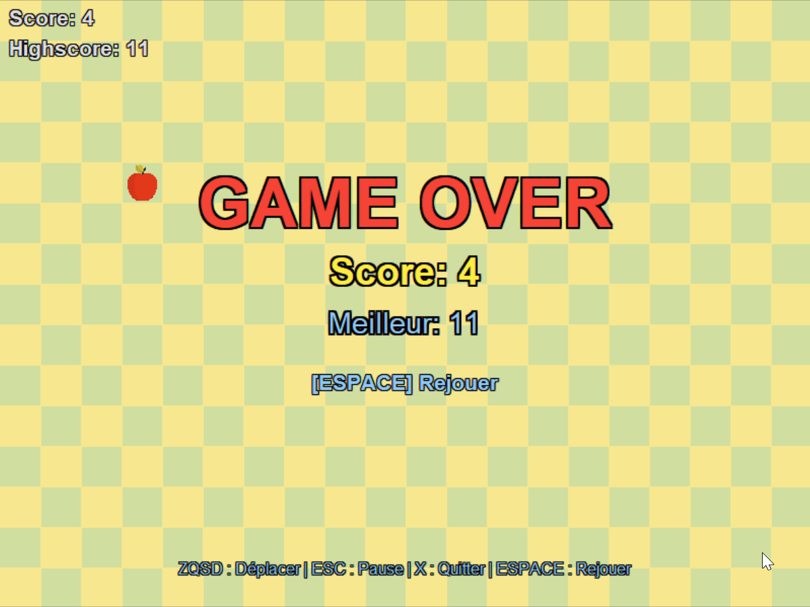

# Snake Game: Classic Snake Game with Turtle

> Classic Snake game implemented in Python using the Turtle module

The Snake game is a classic game where the player controls a snake moving across the board, trying to eat food to grow while avoiding hitting the board edges or biting its own tail. This project implements the Snake game in Python using the Turtle module for graphics.



## 🌐 Language Notice

**Note:** This project's codebase and in-game text are entirely in French, as it was developed as a personal learning project in a French-speaking context. While this README is provided in English for broader accessibility, the variable names, comments, and game interface remain in French.

## 📖 About This Project

This project marks my first steps in software development. Created at the beginning of my computer science studies, it represented at the time a personal challenge to test my programming logic and Python knowledge.

Several years later, armed with the skills acquired during my curriculum, I decided to revisit this project to transform it and apply the best practices I learned:

- **Architectural redesign**: Migration to a modular object-oriented architecture
- **Code organization**: Clear separation of responsibilities with a coherent folder structure
- **Documentation**: Addition of docstrings and explanatory comments
- **Centralized configuration**: Better management of game constants and parameters

This redesign demonstrates my evolution as a developer. While still perfectible, this project illustrates my commitment to producing clean and maintainable code, even for a simple game initially developed in just a few days.

## Features

- Graphical display with Turtle
- Snake control with ZQSD keys or arrow keys
- Increasing snake length by eating food
- Collision detection with board edges and the snake itself
- Player score display
- Persistent high score saving
- Pause menu (Escape key)
- Sound effects (compatible with Windows, macOS, and Linux)
- Modular object-oriented architecture

## Prerequisites

- Python 3.8 or higher
- pip (Python package manager)

## Installation

### Method 1: From Source

1. Clone this repository to your local machine:

   ```shell
   git clone https://github.com/Baddsu51/SnakeGame
   cd SnakeGame
   ```

2. (Optional) Create a virtual environment:

   ```shell
   python -m venv venv
   
   # Windows
   venv\Scripts\activate
   
   # macOS / Linux
   source venv/bin/activate
   ```

3. Install the required dependencies:

   ```shell
   pip install -r requirements.txt
   ```

4. Launch the game:

   ```shell
   python main.py
   ```

### Method 2: Windows Executable

1. Download the latest [Release](https://github.com/Baddsu51/SnakeGame/releases)
2. Run `Snake_mainv3.exe`

## Controls

| Key | Action |
|--------|--------|
| Z or ↑ | Move up |
| S or ↓ | Move down |
| Q or ← | Move left |
| D or → | Move right |
| Esc | Pause / Resume |
| X | Quit game |
| Space | Replay after Game Over |

## Dependencies

- **Pillow**: PNG to GIF image manipulation for Turtle
- **pygame**: Cross-platform sound playback

## Building an Executable

To create a Windows executable with PyInstaller:

```shell
pip install pyinstaller
python -m PyInstaller SnakeGame.spec
```

## License

This project is open source. You are free to use, modify, and distribute it.

## Author

**Baddsu51** - [GitHub](https://github.com/Baddsu51)